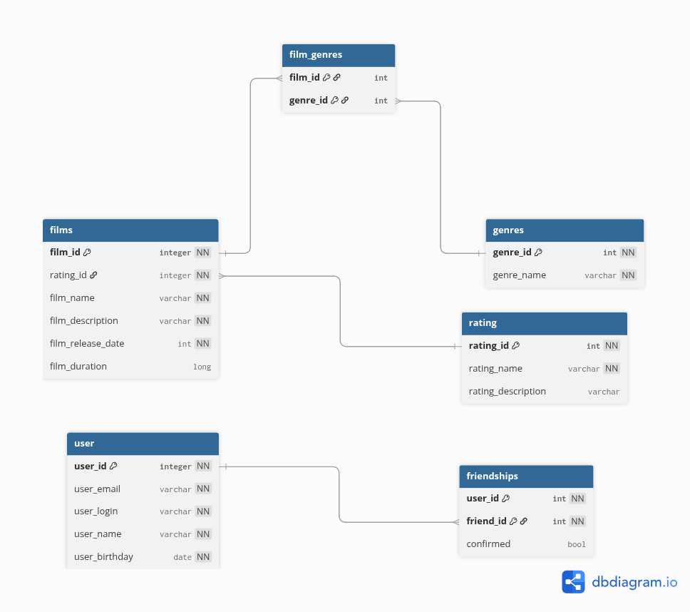

# java-filmorate
Template repository for Filmorate project.

# Схема БД



```sql
select film_id, 
       rating_id
       from films as f
       left join rating as r on f.rating_id = r.rating_id 
                                    and rating_name = 'PG' or 'PG-13';

select film_id,
       genere_id
       from films as f 
       left join generes as g on f.film_id = g.genere_is 
                                     and g.genere_name = "Comedy"
                                     limit 5;
```